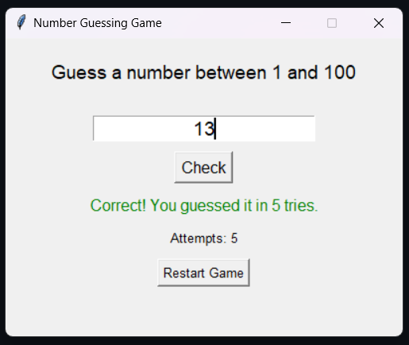

# Number Guessing Game - GUI Version

A simple and fun **number guessing game** with a **graphical user interface (GUI)** built using **Python's Tkinter** module. The player must guess a random number between 1 and 100. The app provides feedback whether the guess is too low, too high, or correct.

---

## Features

- User-friendly GUI interface (no terminal needed)
- Random number generation between 1 to 100
- Real-time feedback after each guess
- Restart/new game option

---

## Screenshot

---

## Tech Stack

- **Language:** Python 3.x
- **Library:** Tkinter (built-in GUI toolkit)

